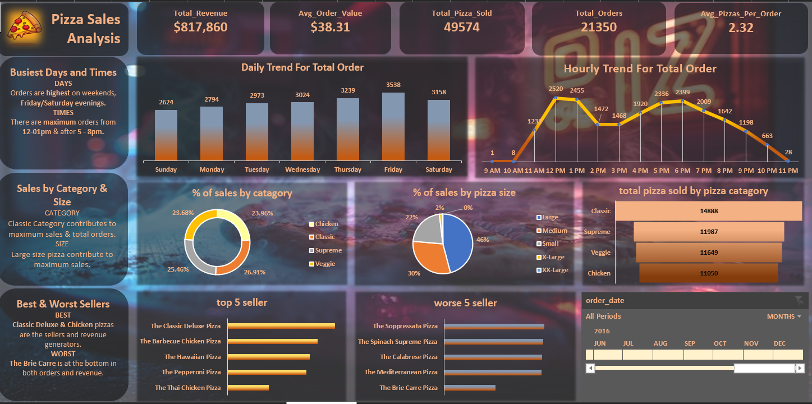

# -Pizza-Sales-Analysis-SQL-Excel-Dashboard-

# Dashboard Preview

#  Project Overview

This project analyzes pizza sales data to uncover insights about customer behavior, sales trends, and product performance.

The analysis was conducted in two stages:

SQL – Used for querying and extracting key business metrics from the dataset.

Excel – Used for data visualization and building an interactive dashboard.

The final result is a dashboard that highlights important business insights such as sales trends, top selling pizzas, category performance, and peak order times.

# Tools & Technologies

SQL – Data querying and metric calculation

Microsoft Excel – Data visualization & interactive dashboard

Pivot Tables – Aggregation and summarization

Charts & Graphs – Visual analytics

# Dataset Description

The dataset contains information about pizza orders including:

Order ID

Order Date & Time

Pizza Category

Pizza Size

Pizza Name

Quantity Ordered

Price

This data allows analysis of sales performance, order behavior, and product popularity.

# SQL Analysis

SQL was used to extract core business metrics from the raw dataset.

Key SQL Calculations

1️⃣ Total Revenue

Total revenue generated from pizza sales.

SELECT SUM(total_price) AS Total_Revenue
FROM pizza_sales;

2️⃣ Average Order Value

Average amount spent per order.

SELECT SUM(total_price) / COUNT(DISTINCT order_id) AS Avg_Order_Value
FROM pizza_sales;

3️⃣ Total Pizzas Sold
SELECT SUM(quantity) AS Total_Pizzas_Sold
FROM pizza_sales;

4️⃣ Total Orders
SELECT COUNT(DISTINCT order_id) AS Total_Orders
FROM pizza_sales;

5️⃣ Average Pizzas Per Order
SELECT 
CAST(
    CAST(SUM(quantity) AS DECIMAL(10,2)) /
    CAST(COUNT(DISTINCT order_id) AS DECIMAL(10,2))
AS DECIMAL(10,2)) AS Avg_Pizzas_Per_Order
FROM pizza_sales;

6️⃣ Daily Order Trend
SELECT DATENAME(WEEKDAY, order_date) AS Order_Day,
COUNT(DISTINCT order_id) AS Total_Orders
FROM pizza_sales
GROUP BY DATENAME(WEEKDAY, order_date);

7️⃣ Hourly Order Trend
SELECT DATEPART(HOUR, order_time) AS Order_Hour,
COUNT(DISTINCT order_id) AS Total_Orders
FROM pizza_sales
GROUP BY DATEPART(HOUR, order_time);

8️⃣ Sales by Category
SELECT pizza_category,
SUM(total_price) AS Revenue
FROM pizza_sales
GROUP BY pizza_category;

9️⃣ Sales by Pizza Size
SELECT pizza_size,
SUM(total_price) AS Revenue
FROM pizza_sales
GROUP BY pizza_size;

🔟 Best Selling Pizzas
SELECT TOP 5 pizza_name,
SUM(quantity) AS Total_Sold
FROM pizza_sales
GROUP BY pizza_name
ORDER BY Total_Sold DESC;
Worst Selling Pizzas
SELECT TOP 5 pizza_name,
SUM(quantity) AS Total_Sold
FROM pizza_sales
GROUP BY pizza_name
ORDER BY Total_Sold ASC;

# Excel Dashboard

After extracting the data using SQL, Microsoft Excel was used to build an interactive dashboard.

Excel Features Used

Pivot Tables

Pivot Charts

Slicers for filtering

Data visualization

Dashboard Highlights

The dashboard provides insights into:

📅 Sales Trends

Daily order trends

Hourly order patterns

🍕 Product Performance

Sales by pizza category

Sales by pizza size

Top 5 best selling pizzas

Bottom 5 worst selling pizzas

📈 Business Metrics

Total Revenue

Total Orders

Average Order Value

Total Pizzas Sold

Average Pizzas Per Order

🕒 Customer Behavior

Orders are highest on weekends (Friday & Saturday evenings).

Most orders occur during 12 PM – 1 PM and 5 PM – 8 PM.

# Key Insights

✔ Total Revenue: $817,860

✔ Total Orders: 21,350

✔ Total Pizzas Sold: 49,574

✔ Average Order Value: $38.31

✔ Average Pizzas per Order: 2.32

Product Insights

Classic pizzas contribute the highest sales.

Large size pizzas generate the most revenue.

Classic Deluxe Pizza is the top selling product.

Brie Carre Pizza has the lowest sales.

Customer Trends

Peak demand occurs during lunch and dinner hours.

Weekends drive the highest order volume.

# Author

Rim Jhim, CSE Student | Data Analytics Enthusiast

LinkedIn: https://www.linkedin.com/in/thamina-khurshed-rimjhim-061130231?utm_source=share&utm_campaign=share_via&utm_content=profile&utm_medium=android_app

⭐ If you found this project interesting, feel free to star the repository.
